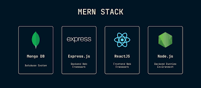
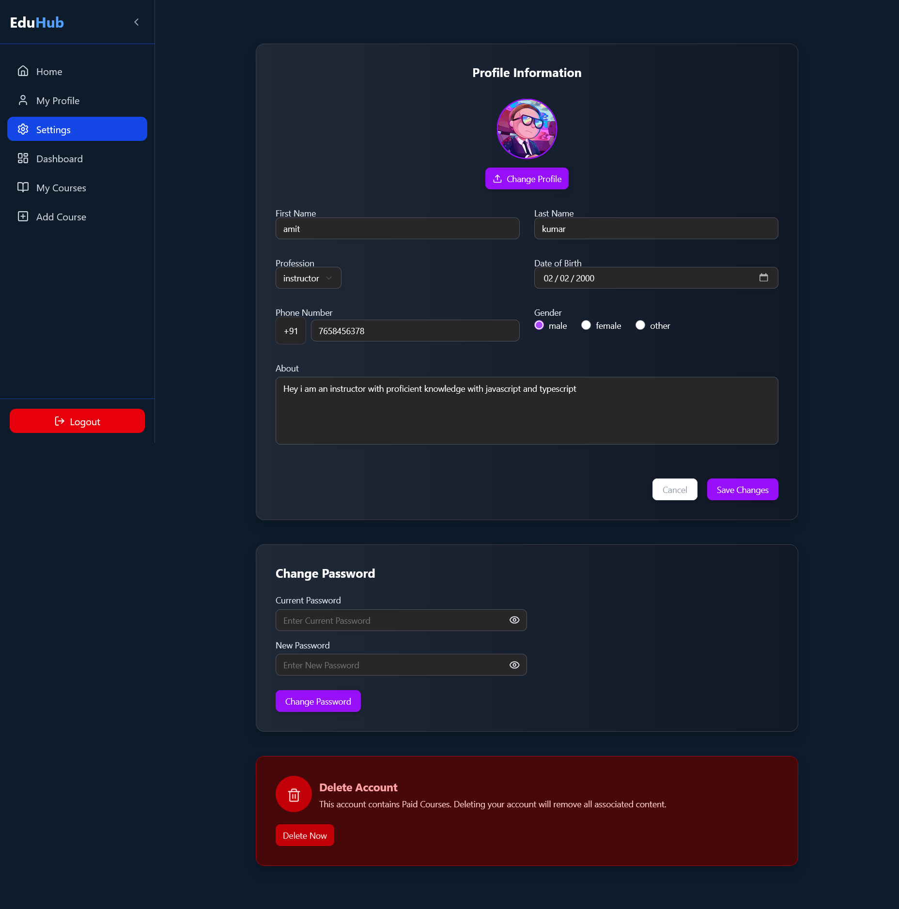
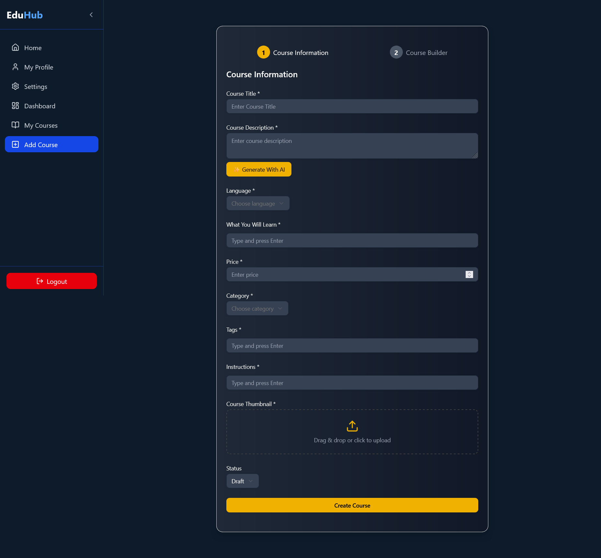
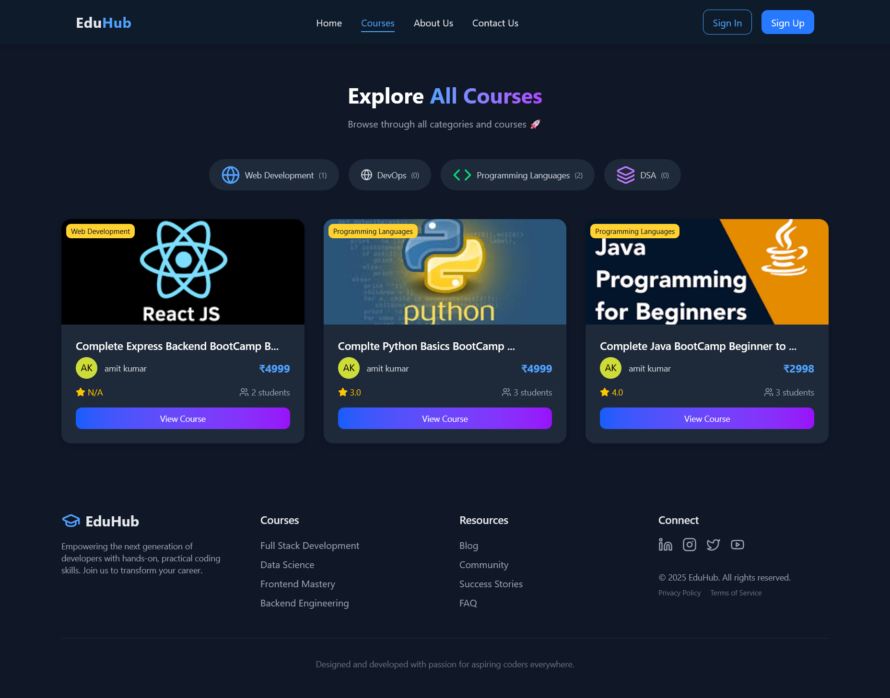
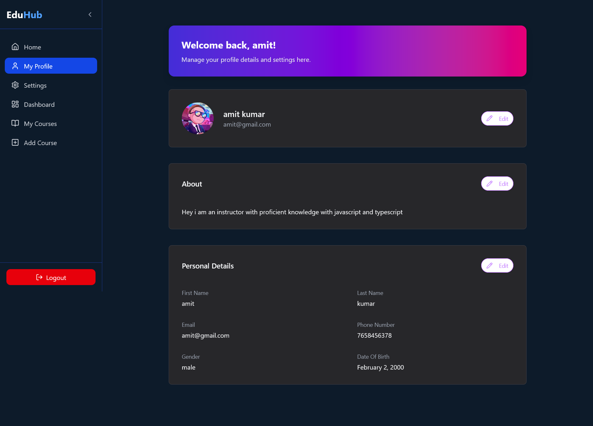
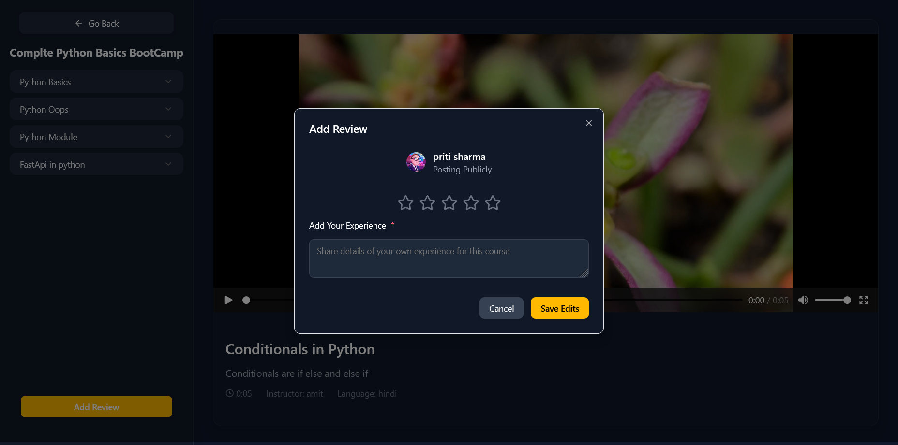

# EduHub 🎓

<p align="center">
  
</p>

<p align="center">
  
  
  
  
</p>

---

## ✨ Overview

EduHub is a modern, full‑stack EdTech platform (think Udemy) built with the MERN stack and TypeScript. It’s designed for both learners and instructors and includes AI-powered authoring, secure authentication, payments, media management, and a clean, responsive UI.

- 🧑‍🎓 For students: Enroll, learn, review, and track progress.
- 👨‍🏫 For instructors: Create, manage, and publish courses with AI assistance.
- 🤖 AI: Generate high-quality course metadata (descriptions, outcomes, tags).
- 🔐 Security: JWT auth, password reset via email.
- 💳 Payments: Stripe integration.
- ☁️ Media: Cloudinary video/image handling.

---

## 📸 Screenshots

<table>
  <tr>
    <td></td>
    <td></td>
    <td></td>
  </tr>
  <tr>
    <td></td>
    <td></td>
    <td></td>
  </tr>
</table>

---

## 🚀 Features

- 🔐 Authentication & Security
  - JWT auth, bcrypt hashing
  - Forgot/Reset password via email links
  - Profile management and password updates

- 👩‍🎓 Student Experience
  - Enroll in courses
  - Watch lessons and track progress
  - Ratings & reviews

- 👨‍🏫 Instructor Experience
  - Create and manage courses, sections, and lessons
  - AI-assisted course descriptions, outcomes, and tags
  - CRUD for courses and content

- 🤖 AI Integration
  - Smart generation of course metadata using Gemini API

- ⚡ Performance & State
  - Zustand-based lightweight state management
  - Responsive UI with Tailwind

---

## 🛠️ Tech Stack

- 💡 Frontend: React, TypeScript, Zustand, TailwindCSS, Vite
- 🔧 Backend: Node.js, Express.js, TypeScript
- 🗄️ Database: MongoDB + Mongoose
- 🔑 Auth: JWT + bcrypt
- 🤖 AI: Google Gemini API
- 🧾 Payments: Stripe
- ☁️ Media: Cloudinary
- 🚀 Deployment: Vercel (FE), Render/Heroku (BE), MongoDB Atlas

---

## 🗂️ Folder Structure

```text
coding-lms/
  backend/
    dist/                      # Compiled JS output (from TypeScript)
      config/
      controllers/
      middlewares/
      models/
      routes/
      templates/
      utils/
      server.js
    src/                       # Backend source (TypeScript)
      config/                  # db.ts, cloudinary.ts, stripe.ts
      controllers/             # auth, user, course, section, subSection, rating/review
      middlewares/             # auth protection, role checks
      models/                  # Mongoose models
      routes/                  # API routes (auth, user, course, ai, payment, etc.)
      templates/               # Email templates (e.g., reset-password.ts)
      utils/                   # helpers (imageUpload, sendEmail, etc.)
      server.ts
    package.json
    tsconfig.json

  frontend/
    dist/                      # Production build output
    src/
      assets/                  # Images, icons, screenshots
      components/              # UI + feature components
        auth/
        dashboard/
        footer/
        header/
        home/
        ui/                    # shadcn primitives
      constants/               # API base URL, roles
      data/                    # static data (sidebar links, etc.)
      pages/                   # app pages (Home, Login, Dashboard, Course, etc.)
      store/                   # Zustand stores
      types/                   # shared types
      utlils/                  # localstorage utils (typo kept as-is)
      App.tsx
      main.tsx
    index.html
    package.json

  README.md
```

---

## ⚙️ Getting Started

Follow these steps to run EduHub locally.

### Prerequisites
- Node.js 18+ and npm
- MongoDB Atlas (or local MongoDB)
- Cloudinary account (for media)
- SMTP credentials (email)
- Stripe Secret Key (payments)
- Google Gemini API key (AI)

### 1) Clone the repository
```bash
git clone https://github.com/ajeetk7ev/EduHub-Coding-EdtechPlatform.git
cd EduHub-Coding-EdtechPlatform
```

### 2) Backend setup
1. Create `backend/.env`:
```dotenv
# App
CLIENT_URL=http://localhost:5173

# Database
MONGO_URI=your_mongo_connection_string

# Auth
JWT_SECRET=super_secret_jwt_key

# Email (SMTP)
MAIL_HOST=smtp.yourprovider.com
MAIL_USER=your_smtp_user
MAIL_PASS=your_smtp_password

# Cloudinary
CLOUDINARY_CLOUD_NAME=xxxx
CLOUDINARY_API_KEY=xxxx
CLOUDINARY_API_SECRET=xxxx

# Payments (Stripe)
STRIPE_SECRET_KEY=sk_test_or_live_key

# AI
GEMINI_API_KEY=your_gemini_api_key

# Optional
FOLDER_NAME=course-videos
```

2. Install and run:
```bash
cd backend
npm install
npm run dev
```
- Server: http://localhost:3000
- Production:
```bash
npm run build
npm start
```

### 3) Frontend setup
- Point FE to local API:
  - Edit `frontend/src/constants/api.ts`:
```ts
export const API_URL = "http://localhost:3000/api";
```

- Install and run FE:
```bash
cd ../frontend
npm install
npm run dev
```
- App: http://localhost:5173

### 4) Build (optional)
- Frontend:
```bash
npm run build
npm run preview
```
- Backend:
```bash
cd ../backend
npm run build
npm start
```

### Notes
- Ensure `CLIENT_URL` matches your frontend origin for CORS and auth emails.
- For production, set `API_URL` in the frontend to your deployed backend URL.
- Make sure your MongoDB connection allows your IP or uses proper network rules.

---

## 🧪 Useful Scripts

- Backend:
  - `npm run dev` — start in dev with ts-node + nodemon
  - `npm run build` — compile TypeScript
  - `npm start` — run compiled server

- Frontend:
  - `npm run dev` — start Vite dev server
  - `npm run build` — production build
  - `npm run preview` — preview production build

---

## 💡 Roadmap

- 📊 Advanced analytics for instructors
- 🧾 Invoices and detailed payment history
- 🌐 i18n support
- 🔎 Search and filtering enhancements
- 🧠 More AI-assisted authoring features

---

## 🤝 Contributing

Contributions are welcome! Please open an issue or submit a PR for enhancements or bug fixes.

---

